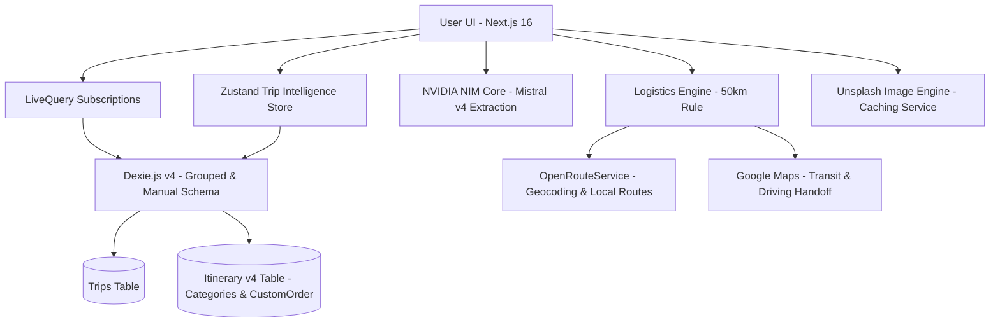

# RouteMate v2.7.0 - The Hybrid Travel Engine 🌍✨

RouteMate is a mobile-first, offline-capable travel intelligence application. Version 2.0 introduced a massive architectural shift from simple itineraries to a **Date-Grouped Intelligence Engine** that manages your entire travel flow.


## ✨ New in v2.0-v2.2

### 📅 Date-Grouped Timeline (The Accordion)
Replaced the static Radar tab with a high-performance, date-grouped timeline.
- **Smart Expansion**: Automatically expands "Today's" plans on load.
- **Sticky Geography**: Headers stick to the top during scroll, so you always know which day you're viewing.
- **Category Summary**: Day headers show icon badges (✈️ 🏨 🚆) for an instant itinerary overview.

### 🧠 Transit Intelligence (The 50km Rule)
Our new logistics engine calculates physical distance between stops using the **Haversine Formula**:
- **Local (< 50km)**: One-tap Smart Handoff to **Google Maps Transit**.
- **Inter-city (>= 50km)**: Automatically suggests **Driving Directions** and updates the UI to "Inter-city Connection."

### 💎 Category Intelligence & Glow
Itinerary points are now classified into 6 smart categories: `Flight`, `Lodging`, `Food`, `Activity`, `Train`, and `Rental`.
- **Unique Visual Identity**: Each category has a signature neon glow (Blue/Green/Amber/Purple).
- **AI-Powered Extraction**: NVIDIA NIM high-fidelity coordinate extraction for precise routing.

### 🎨 Minimalist Premium Branding
Uniform, high-end "ROUTEMATE" signature across all screens with contextual back-navigation. v2.1 introduced a **Compact Widget Row** to optimize itinerary real estate.

### 📅 Interactive Creation (v2.1)
Replaced instant placeholders with a premium **New Trip Modal** to capture precise destinations and dates before planning begins.

### 🎯 Hybrid Intelligence (v2.4 - v2.6)
We've moved beyond purely automatic sorting to a system that respects your manual intent.
- **Fluid Reorder API**: Drag-and-drop any item on your timeline with an elastic, premium physical feel.
- **Unsplash Visual Engine**: Trips now feature full-bleed destination imagery, atmospheric blurred backgrounds, and glassmorphism headers.
- **Mistral Small 4 (119B) Core**: Ultra-fast AI extraction with 2026-hardened chronological buffers (Arrival 08:00 / Hotel 15:00). Verified on mistral-small-4-119b-2603.
- **Persistent Local Cache**: Images and manual sort orders are saved directly to **Dexie v4**.
- **Integrity Diagnostic Suite**: Built-in pre-flight tool to verify API health and logic integrity.

## 🛠️ Tech Stack

- **Framework**: Next.js 16 (App Router)
- **Styling**: Tailwind CSS 4 + Framer Motion (Accordion & Reorder)
- **Database**: Dexie.js (IndexedDB) v4 (Manual Sorting Support)
- **AI**: NVIDIA NIM (Mistral Small 4 119B Instruct / Mistral Large 3 Fallback)
- **Imaging**: Unsplash API (Landscape Architecture)
- **Logistics**: OpenRouteService (ORS) + Google Maps Handoff + Haversine Logic

## 🏗️ Architecture v2.0



## 🚀 Getting Started

1. **Clone & Install**:
   ```bash
   git clone https://github.com/strike007-3000/RouteMate.git
   npm install
   ```
2. **Environment**:
   Add `NVIDIA_API_KEY`, `NEXT_PUBLIC_UNSPLASH_ACCESS_KEY`, and `ORS_API_KEY` to your `.env`.
3. **Pre-flight Integrity Check**:
   Before deploying or testing, verify your configuration and AI logic:
   ```bash
   npm run test:integrity
   ```
4. **Run**:
   ```bash
   npm run dev
   ```

---
Built with ❤️ for travelers who value intelligence and design.
