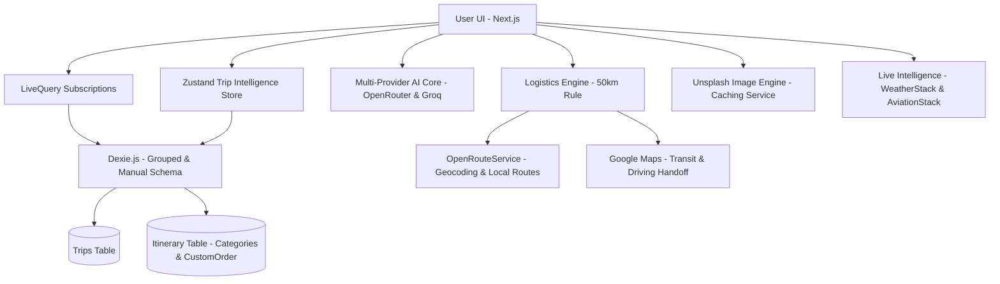

# routemate.top — Immersive Travel Intelligence 🌌✨

routemate.top is a mobile-first, offline-capable travel intelligence application driven by a **Date-Grouped Intelligence Engine**, a **Dual-View Distinction System**, and **Live API Intelligence** (Weather & Flight Tracking).

---

## ✨ Core Features

### 🌓 Dual-View Distinction (Summary vs. Logistics)
A state-driven interface that toggles between high-level emotional planning and granular logistical execution.
- **Summary Mode (Itinerary)**: Maximizes visual impact with "Day Cards" featuring curated Unsplash imagery and a unified 32px radius. It hides technical connectors and transit routing widgets to prioritize the "scannability" of the trip.
- **Logistics Mode (Timeline)**: Enables a continuous, dashed journey thread with precision-aligned dots. It surfaces full `TransitCard` widgets (with Google Maps handoff, times, and distances) to help you understand exactly how to navigate between points.

### 🌌 Premium Micro-interactions & Polish
- **Scroll-Driven Headers**: Enforces the Zero-Jump Header Rhythm. Headers shrink dynamically on scroll by fading the top brand label and scaling down titles, leveraging native CSS scroll timelines and custom property fallbacks.
- **Swipe-to-Delete Gestures**: Implements a horizontal swipe action (via Framer Motion) on timeline items. Swiping left reveals a red deletion zone and locks the card to prompt confirmation, matching the interactive delete confirmation state.
- **Fluid Page Morphing (View Transitions)**: Connects page transitions by morphing card cover images and titles into their corresponding page hero components.

### 🛡️ Hardening & Architecture
Enterprise-grade reliability and security pass.
- **Header-Based Auth**: Moved sensitive API keys to request headers to prevent plain-text logging.
- **Parallel Logistics**: Leverages `Promise.all()` for concurrent geocoding, cutting transit calculation time by 50%.
- **UUID Stability**: Replaced random ID generation with `crypto.randomUUID()` for robust IndexedDB persistence.
- **Optimized Sorting**: Implemented a two-pass sorting architecture with $O(N)$ pre-calculation for instant UI updates.
- **RSC Split Architecture**: Converted core pages into React Server Component shells to minimize client-side javascript parsing footprints.
- **Image Optimization & Proxy**: Upgraded raw images to Next.js `<Image>` components, optimized package imports in `next.config.ts`, and implemented a secure backend API proxy route for Unsplash imagery.
- **LLM Determinism**: Enforced zero temperature configurations for smart city discovery and itinerary parsing models.

### ⛅ Live Intelligence (Weather & Flight Logistics)
The system now proactively fetches real-time data to help you prepare for your journey.
- **Real-Time Weather (Packing Context)**: Shows current temperatures and weather icons for today and tomorrow in your itinerary headers.
- **Live Flight Tracking**: Displays real-time flight statuses (Active, Delayed, Landed), gate numbers, and terminals. 
- **Smart Optimization**: Implements strict API management—weather is only fetched for the current/next day, and flight status only activates within 24 hours of departure.
- **Route-Based Search fallback**: If a flight number is missing, the system uses extracted airport codes to find matching flights, allowing you to select and "lock in" tracking metadata.

### 📍 Intelligent Directions & Routing
Advanced navigation logic that understands the context of your journey.
- **Contextual 'Between-Stop' Routing**: Clicking a stop's Map Pin now automatically calculates directions **from the previous stop** in the timeline rather than just your current location.
- **Hub Precision**: Intelligent handoff detection ensures navigation routes directly to specific **Airport Terminals** (using IATA codes) rather than generic city centers.

### 🧠 Adaptive Intelligence Engine (Hybrid AI Core)
- **Dynamic Provider Routing**: The extraction engine execution queue dynamically re-sorts itself based on your preferences. It checks the local client's "Preferred AI" toggle, falls back to the server's `PRIMARY_AI_PROVIDER` environment variable, and defaults to OpenRouter.
- **Multi-Tier Failover**: Implemented a hardened resilience layer. If the preferred provider fails or is rate-limited, the engine automatically traverses the queue to the next provider/model (e.g., failing over from OpenRouter Free to Groq Llama 3.3).
- **JSON Object Enforcement**: Native `json_object` mode eliminates markdown artifacts and parsing failures.

### 🗺️ Explore Screen & Fallback AI Curation Engine (v3.18.0)
A dual-mode discovery dashboard that blends pre-curated locations with dynamic, real-time AI mapping:
- **Curated Global Catalog**: Prepopulated with 20 world-class travel destinations, each featuring detailed descriptions, tags, and 5 curated highlight attractions.
- **On-Demand Fallback AI Curation**: When searching for a destination not in the database, users can trigger an interactive configuration modal to specify custom planning intents and vibe modifier chips (e.g. Food & Dining, Hidden Gems) before requesting curation.
- **Progressive Loading**: Provides a multi-stage loading tracker status representing coordinates mapping, landmark synthesis, image sourcing, and database commit stages in real-time.
- **Preview & Caching Guardrails**: Synced curations are held strictly in transient memory. Database storage into IndexedDB only occurs when the user explicitly clicks "Confirm & Save". Clicking "Cancel/Re-roll" discards transient states and re-opens intent configurations.
- **Spark Itinerary Builder**: Generate custom day-by-day itineraries directly from any explored location by choosing dates and a travel style/vibe, then routing straight into the timeline. Features strict calendar enforcement to guarantee timeline math alignment.
- **Balanced API Load Sharing**: Split provider default routes, directing Smart Paste extractions to Groq and Explore Discovery to OpenRouter to balance API limits.
- **Favorites Integration**: Easily toggle places to a Saved page, synchronizing to local IndexedDB.

### 🔒 Secure Authentication
Seamless integration with Clerk for user management and secure authentication.
- **Embedded Interface**: Uses custom-styled, dark mode Clerk forms embedded directly on `/login` and `/signup` routes.
- **Single Sign-On (SSO)**: Supports fast onboarding using Google Sign-in.

---

## 🛠️ Tech Stack

- **Framework**: Next.js (App Router)
- **Authentication**: Clerk (Embedded Components & Social/Magic Links)
- **Styling**: Tailwind CSS + Framer Motion
- **Database**: Dexie.js (IndexedDB)
- **AI Core**: OpenRouter + Groq (Multi-Provider Hybrid Stack)
- **Intelligence APIs**: WeatherStack (Weather) + AviationStack (Flight Status)
- **Imaging**: Unsplash API
- **Logistics**: OpenRouteService (Geocoding) + Google Maps (Transit Handoff)

---

## 🏗️ Architecture



---

## 🚀 Getting Started

1. **Clone & Install**:
   ```bash
   git clone https://github.com/strike007-3000/RouteMate.git
   npm install
   ```
2. **Environment Variables**:
   * **Production (Vercel)**: Environment variables are securely managed in the Vercel Dashboard under Project Settings.
   * **Local Development (Infisical)**: The `npm run dev` and `npm run build` scripts automatically detect if the Infisical CLI is installed; if it is, they run with the `infisical run --` wrapper. If not, they fallback to standard Next.js execution.
   * **Alternative Local Config**: If you prefer not to use Infisical locally, you can create a local `.env` file using the keys outlined in `.env.example`.

   *Note: `PRIMARY_AI_PROVIDER` controls the server-side default model queue. If a client explicitly saves a Preferred AI Provider in the UI Settings Modal, it will override this default.*
3. **Pre-flight Integrity Check**:
   Before deploying or testing, verify your configuration and AI logic:
   ```bash
   npm run test:integrity
   ```
4. **Run**:
   ```bash
   npm run dev
   ```

---
Built with ❤️ for travelers who value intelligence, design, and precision.

---

## ⚖️ Legal & Non-Affiliation Notice

**routemate.top** is a free, open-source personal travel planning utility built for individual developers and leisure travelers.

This project has **no affiliation, connection, partnership, or association** of any kind with any commercial fleet tracking platforms, B2B logistics routing software, enterprise courier services, or freight management systems.

Any similarity in name to commercial logistics products is entirely coincidental. This tool is designed exclusively for consumer leisure travel itinerary planning and is provided at no cost, with no commercial paywalls or subscription fees.
