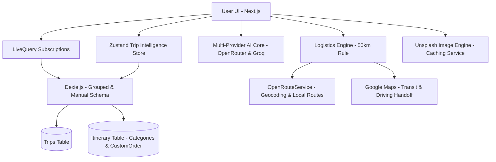

# RouteMate v3.1.0 - Immersive Travel Intelligence 🌌✨

RouteMate is a mobile-first, offline-capable travel intelligence application driven by a **Date-Grouped Intelligence Engine**, a **Dual-View Distinction System**, and **Live API Intelligence** (Weather & Flight Status).


## ✨ Core Features

### 🌓 Dual-View Distinction (Summary vs. Logistics)
A state-driven interface that toggles between high-level emotional planning and granular logistical execution.
- **Summary Mode (Itinerary)**: Maximizes visual impact with "Day Cards" featuring curated Unsplash imagery and a unified 32px radius. It hides technical connectors and transit routing widgets to prioritize the "scannability" of the trip.
- **Logistics Mode (Timeline)**: Enables a continuous, dashed journey thread with precision-aligned dots. It surfaces full `TransitCard` widgets (with Google Maps handoff, times, and distances) to help you understand exactly how to navigate between points.

### 📍 Intelligent Directions & Routing
Advanced navigation logic that understands the context of your journey.
- **Contextual 'Between-Stop' Routing**: Clicking a stop's Map Pin now automatically calculates directions **from the previous stop** in the timeline rather than just your current location.
- **Hub Precision**: Intelligent handoff detection ensures navigation routes directly to specific **Airport Terminals** (using IATA codes) rather than generic city centers.

### 🌅 Immersive Hero & Luxury Imagery
- **Curated Unsplash Logic**: Integrated `&featured=true` and `content_filter=high` into the image engine to ensure every trip looks like a luxury travel magazine.
- **Triple-Gradient Logic**: Deep linear gradients (`black/90` base) ensure text contrast while maintaining image clarity.

### 🧠 Adaptive Intelligence Engine (Configurable Hybrid Routing)
- **Dynamic Provider Routing**: The extraction engine execution queue dynamically re-sorts itself based on your preferences. It checks the local client's "Preferred AI" toggle, falls back to the server's `PRIMARY_AI_PROVIDER` environment variable, and defaults to OpenRouter.
- **Zero-Cost Reliability**: Migrated to a multi-provider stack using **OpenRouter** and **Groq** for an always-free extraction experience.
- **Multi-Tier Failover**: Implemented a hardened resilience layer. If the preferred provider fails or is rate-limited, the engine automatically traverses the queue to the next provider/model (e.g., failing over from OpenRouter Free to Groq Llama 3.3).
- **JSON Object Enforcement**: Native `json_object` mode eliminates markdown artifacts and parsing failures.

### 🧠 Logistical Engine (Hardened)
- **Sorted Journey Thread**: Hardened sorting logic ensures Departures from destinations always precede Arrivals at the home base.
- **Return Flight Anchoring**: Automatically detects arrivals in the "Home Base" city and forces them to the absolute bottom of the timeline.
- **Lodging Splitting**: Multi-day stays are automatically visualized as distinct Check-in and Check-out cards.

## 🛠️ Tech Stack

- **Framework**: Next.js (App Router)
- **Styling**: Tailwind CSS + Framer Motion
- **Database**: Dexie.js (IndexedDB)
- **AI**: OpenRouter + Groq (Multi-Provider Free Stack)
- **Imaging**: Unsplash API
- **Logistics**: OpenRouteService + Google Maps Handoff

## 🏗️ Architecture



## 🚀 Getting Started

1. **Clone & Install**:
   ```bash
   git clone https://github.com/strike007-3000/RouteMate.git
   npm install
   ```
2. **Environment**:
   Add `OPENROUTER_API_KEY`, `GROQ_API_KEY`, `UNSPLASH_ACCESS_KEY`, and `ORS_API_KEY` to your `.env`.
3. **Pre-flight Integrity Check**:
   Before deploying or testing, verify your configuration and AI logic:
   ```bash
   npm run test:integrity
   ```
4. **Run**:
   ```bash
   npm run dev
   ```

---
Built with ❤️ for travelers who value intelligence and design.
