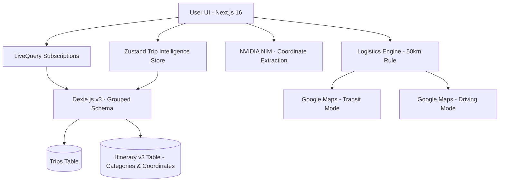

# RouteMate v2.0 - The Smart Travel Companion 🌍✈️

RouteMate is a mobile-first, offline-capable travel intelligence application. Version 2.0 introduces a massive architectural shift from simple itineraries to a **Date-Grouped Intelligence Engine** that manages your entire travel flow.


## ✨ New in v2.0

### 📅 Date-Grouped Timeline (The Accordion)
Replaced the static Radar tab with a high-performance, date-grouped timeline.
- **Smart Expansion**: Automatically expands "Today's" plans on load.
- **Sticky Geography**: Headers stick to the top during scroll, so you always know which day you're viewing.
- **Category Summary**: Day headers show icon badges (✈️ 🏨 🚆) for an instant itinerary overview.

### 🧠 Transit Intelligence (The 50km Rule)
Our new logistics engine calculates physical distance between stops using the **Haversine Formula**:
- **Local (< 50km)**: One-tap Smart Handoff to **Google Maps Transit**.
- **Inter-city (>= 50km)**: Automatically suggests **Driving Directions** and updates the UI to "Inter-city Connection."

### 💎 Category Intelligence & Glow
Itinerary points are now classified into 6 smart categories: `Flight`, `Lodging`, `Food`, `Activity`, `Train`, and `Rental`.
- **Unique Visual Identity**: Each category has a signature neon glow (Blue/Green/Amber/Purple).
- **AI-Powered Extraction**: NVIDIA NIM high-fidelity coordinate extraction for precise routing.

### 🎨 Minimalist Premium Branding
Uniform, high-end "ROUTEMATE" signature across all screens with contextual back-navigation for a seamless, immersive experience.

## 🛠️ Tech Stack

- **Framework**: Next.js 16 (App Router)
- **Styling**: Tailwind CSS 4 + Framer Motion (Accordion Physics)
- **Database**: Dexie.js (IndexedDB) v3 (Grouped Schema)
- **AI**: NVIDIA NIM (Llama 3.1 70B Instruct)
- **Logistics**: Google Maps Directory API + Haversine Distance Logic

## 🏗️ Architecture v2.0



## 🚀 Getting Started

1. **Clone & Install**:
   ```bash
   git clone https://github.com/strike007-3000/RouteMate.git
   npm install
   ```
2. **Environment**:
   Add `NVIDIA_API_KEY` to your `.env` or via the in-app settings.
3. **Run**:
   ```bash
   npm run dev
   ```

---
Built with ❤️ for travelers who value intelligence and design.
