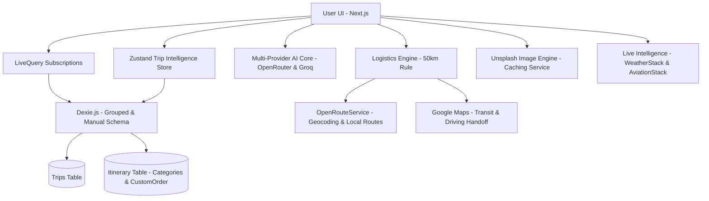

# RouteMate v3.3.5 - Immersive Travel Intelligence 🌌✨

RouteMate is a mobile-first, offline-capable travel intelligence application driven by a **Date-Grouped Intelligence Engine**, a **Dual-View Distinction System**, and **Live API Intelligence** (Weather & Flight Tracking).


## ✨ Core Features

### 🌓 Dual-View Distinction (Summary vs. Logistics)
A state-driven interface that toggles between high-level emotional planning and granular logistical execution.
- **Summary Mode (Itinerary)**: Maximizes visual impact with "Day Cards" featuring curated Unsplash imagery and a unified 32px radius. It hides technical connectors and transit routing widgets to prioritize the "scannability" of the trip.
- **Logistics Mode (Timeline)**: Enables a continuous, dashed journey thread with precision-aligned dots. It surfaces full `TransitCard` widgets (with Google Maps handoff, times, and distances) to help you understand exactly how to navigate between points.

### 🌌 Premium Micro-interactions & Polish (v3.4+)
- **Scroll-Driven Headers**: Enforces the Zero-Jump Header Rhythm. Headers shrink dynamically on scroll by fading the top brand label and scaling down titles, leveraging native CSS scroll timelines and custom property fallbacks.
- **Swipe-to-Delete Gestures**: Implements a horizontal swipe action (via Framer Motion) on timeline items. Swiping left reveals a red deletion zone and locks the card to prompt confirmation, matching the interactive delete confirmation state.
- **Fluid Page Morphing (View Transitions)**: Connects page transitions by morphing card cover images and titles into their corresponding page hero components.

### 🛡️ Hardening & Architecture (v3.3+)
Enterprise-grade reliability and security pass.
- **Header-Based Auth**: Moved sensitive API keys to request headers to prevent plain-text logging.
- **Parallel Logistics**: Leverages `Promise.all()` for concurrent geocoding, cutting transit calculation time by 50%.
- **UUID Stability**: Replaced random ID generation with `crypto.randomUUID()` for robust IndexedDB persistence.
- **Optimized Sorting**: Implemented a two-pass sorting architecture with $O(N)$ pre-calculation for instant UI updates.

### ⛅ Live Intelligence (Weather & Flight Logistics)
The system now proactively fetches real-time data to help you prepare for your journey.
- **Real-Time Weather (Packing Context)**: Shows current temperatures and weather icons for today and tomorrow in your itinerary headers.
- **Live Flight Tracking**: Displays real-time flight statuses (Active, Delayed, Landed), gate numbers, and terminals. 
- **Smart Optimization**: Implements strict API management—weather is only fetched for the current/next day, and flight status only activates within 24 hours of departure.
- **Route-Based Search fallback**: If a flight number is missing, the system uses extracted airport codes to find matching flights, allowing you to select and "lock in" tracking metadata.

### 📍 Intelligent Directions & Routing
Advanced navigation logic that understands the context of your journey.
- **Contextual 'Between-Stop' Routing**: Clicking a stop's Map Pin now automatically calculates directions **from the previous stop** in the timeline rather than just your current location.
- **Hub Precision**: Intelligent handoff detection ensures navigation routes directly to specific **Airport Terminals** (using IATA codes) rather than generic city centers.

### 🧠 Adaptive Intelligence Engine (Hybrid AI Core)
- **Dynamic Provider Routing**: The extraction engine execution queue dynamically re-sorts itself based on your preferences. It checks the local client's "Preferred AI" toggle, falls back to the server's `PRIMARY_AI_PROVIDER` environment variable, and defaults to OpenRouter.
- **Multi-Tier Failover**: Implemented a hardened resilience layer. If the preferred provider fails or is rate-limited, the engine automatically traverses the queue to the next provider/model (e.g., failing over from OpenRouter Free to Groq Llama 3.3).
- **JSON Object Enforcement**: Native `json_object` mode eliminates markdown artifacts and parsing failures.

## 🛠️ Tech Stack

- **Framework**: Next.js (App Router)
- **Styling**: Tailwind CSS + Framer Motion
- **Database**: Dexie.js (IndexedDB)
- **AI Core**: OpenRouter + Groq (Multi-Provider Hybrid Stack)
- **Intelligence APIs**: WeatherStack (Weather) + AviationStack (Flight Status)
- **Imaging**: Unsplash API
- **Logistics**: OpenRouteService (Geocoding) + Google Maps (Transit Handoff)

## 🏗️ Architecture



## 🚀 Getting Started

1. **Clone & Install**:
   ```bash
   git clone https://github.com/strike007-3000/RouteMate.git
   npm install
   ```
2. **Environment Variables**:
   Create a `.env` file with the following keys:
   ```env
   # AI Providers
   OPENROUTER_API_KEY=your_key
   GROQ_API_KEY=your_key
   PRIMARY_AI_PROVIDER=OpenRouter # Or Groq (defaults to OpenRouter if unset)

   # Imaging & Logistics
   UNSPLASH_ACCESS_KEY=your_key
   ORS_API_KEY=your_key

   # Live Intelligence
   WEATHERSTACK_API_KEY=your_key
   AVIATIONSTACK_API_KEY=your_key

   # Authentication (Clerk)
   NEXT_PUBLIC_CLERK_PUBLISHABLE_KEY=pk_your_publishable_key
   CLERK_SECRET_KEY=sk_your_secret_key
   NEXT_PUBLIC_CLERK_SIGN_IN_URL=/login
   NEXT_PUBLIC_CLERK_SIGN_UP_URL=/login
   ```
   *Note: `PRIMARY_AI_PROVIDER` controls the server-side default model queue. If a client explicitly saves a Preferred AI Provider in the UI Settings Modal, it will override this default. In RouteMate v3.4.1+, the client-side `preferredAiProvider` store has been migrated (via a Version 1 Zustand schema upgrade) to default to an empty string (`""`) for existing profiles, ensuring the server-side fallback (`PRIMARY_AI_PROVIDER`) behaves correctly without being overridden by stale rehydrated defaults.*
3. **Pre-flight Integrity Check**:
   Before deploying or testing, verify your configuration and AI logic:
   ```bash
   npm run test:integrity
   ```
4. **Run**:
   ```bash
   npm run dev
   ```

---
Built with ❤️ for travelers who value intelligence, design, and precision.
