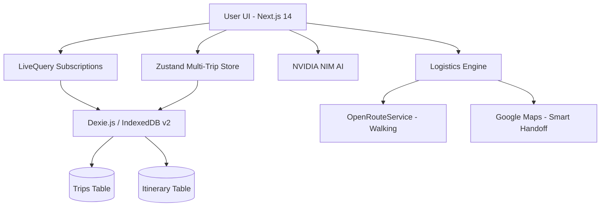

# RouteMate - The Pocket-Friendly Open-Source Travel Planner 🌍✈️

RouteMate is a mobile-first, offline-capable travel itinerary application designed for the modern traveler. It focuses on **Automatic Logistics**: saving you from the "travel logistics gap" between your destinations.


## ✨ Features

### 1. Multi-Trip Management (Wanderlog Style)
Plan multiple adventures simultaneously. Your dashboard categorizes trips into **Upcoming**, **Past**, and **Drafts**, each with its own dynamic timeline and logistics engine.

### 2. Magic Extraction (Powered by NVIDIA NIM)
Paste messy confirmation emails or flight details. Our AI engine (Mistral/Step-3.5) extracts structured data specifically for your active trip.

### 3. Smart Handoff Logistics
- **Walking (< 2km)**: Detailed steps directly in your timeline.
- **Transit (> 2km)**: One-tap **Smart Handoff** to Google Maps Transit, pre-configured with your specific origin and destination.

### 4. Visual Excellence (Unsplash Integration)
Every trip card automatically fetches a stunning cover photo from Unsplash based on the destination name, creating a premium, travel-editor aesthetic.

### 5. Destination Discovery & Radar
- **Explore**: Curated destination recommendations for the modern nomad.
- **Radar**: Satellite-level scanning for nearby transit hubs using the browser Geolocation API, with global fallbacks for restricted environments.

## 🛠️ Tech Stack

- **Framework**: Next.js 14 (App Router)
- **Styling**: Tailwind CSS + Framer Motion
- **Database**: Dexie.js (IndexedDB) + `dexie-react-hooks`
- **AI**: NVIDIA NIM (Mistral Large 3 / Step 3.5 Flash)
- **Maps**: OpenRouteService (OSM)
- **State**: Zustand + LiveQuery Subscriptions

## 🚀 Getting Started

1. **Clone the repository**:
   ```bash
   git clone https://github.com/strike007-3000/RouteMate.git
   ```
2. **Install dependencies**:
   ```bash
   npm install
   ```
3. **Environment Setup**:
   Copy `.env.example` to `.env` and add your `NVIDIA_API_KEY`. Alternatively, just run the app and enter your key in the **Settings** modal.
4. **Run the app**:
   ```bash
   npm run dev
   ```

## 🏗️ Architecture



## 🤝 Contributing

We welcome contributions! Please see [CONTRIBUTING.md](CONTRIBUTING.md) for details on our code of conduct and the process for submitting pull requests.

## 🛡️ Security

If you discover a security vulnerability, please review our [SECURITY.md](SECURITY.md) for reporting steps.

## 📜 License

This project is licensed under the MIT License - see the [LICENSE](LICENSE) file for details.

## 🚀 Project Lifecycle & Releases

RouteMate uses an automated delivery pipeline:
- **Versioning**: Managed by `release-please` based on [Conventional Commits](https://www.conventionalcommits.org/).
- **Automatic Changelogs**: Every merged feature automatically generates a professional changelog entry.
- **Milestones**: Check the [Releases](https://github.com/strike007-3000/RouteMate/releases) tab for the latest stable builds and artifacts.

---
Built with ❤️ for travelers by the RouteMate Community.

