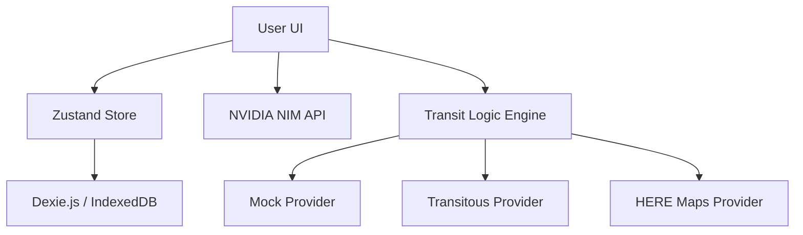

# RouteMate - The Pocket-Friendly Open-Source Travel Planner 🌍✈️

RouteMate is a mobile-first, offline-capable travel itinerary application designed for the modern traveler. It focuses on **Automatic Logistics**: saving you from the "travel logistics gap" between your destinations.


## ✨ Features

### 1. Magic Extraction (Powered by NVIDIA NIM)
Paste your messy confirmation emails, flight details, or hotel bookings. Our AI engine (Mistral/Step-3.5) extracts the structured data and injects it directly into your timeline.

### 2. Automatic Logistics (Cheap Route)
Whenever a gap is detected between two events (e.g., Airport Arrival → Hotel), RouteMate automatically suggests the **cheapest and most efficient** public transport route.

### 3. Offline-First & Private
Built with **Dexie.js (IndexedDB)** and **Zustand**, your data never leaves your device unless you choose to. Perfect for international travel without a data plan.

### 4. Hybrid Secret Management (BYOK)
Use your own API keys for AI and Map features. Key handling is hybrid: set them as environment variables for production or use the in-app Settings UI for local development.

## 🛠️ Tech Stack

- **Framework**: Next.js 14 (App Router)
- **Styling**: Tailwind CSS + Framer Motion
- **Database**: Dexie.js (IndexedDB)
- **AI**: NVIDIA NIM (Mistral Large 3 / Step-3.5 Flash)
- **State**: Zustand

## 🚀 Getting Started

1. **Clone the repository**:
   ```bash
   git clone https://github.com/strike007-3000/RouteMate.git
   ```
2. **Install dependencies**:
   ```bash
   npm install
   ```
3. **Environment Setup**:
   Copy `.env.example` to `.env` and add your `NVIDIA_API_KEY`. Alternatively, just run the app and enter your key in the **Settings** modal.
4. **Run the app**:
   ```bash
   npm run dev
   ```

## 🏗️ Architecture



## 🤝 Contributing

We welcome contributions! Please see [CONTRIBUTING.md](CONTRIBUTING.md) for details on our code of conduct and the process for submitting pull requests.

## 🛡️ Security

If you discover a security vulnerability, please review our [SECURITY.md](SECURITY.md) for reporting steps.

## 📜 License

This project is licensed under the MIT License - see the [LICENSE](LICENSE) file for details.

---
Built with ❤️ for travelers by the RouteMate Community.
